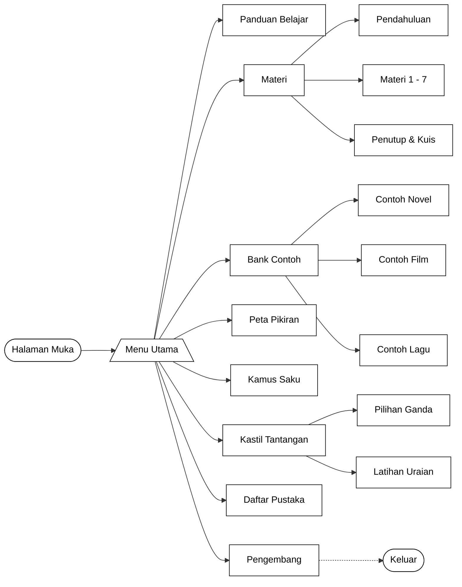

# 🐱 Ulasin — Media Pembelajaran Teks Ulasan Interaktif

**Ulasin** adalah aplikasi web interaktif yang dirancang khusus sebagai media pembelajaran materi **Teks Ulasan** (Resensi) untuk siswa SMP. Dibangun menggunakan teknologi web modern, Ulasin menawarkan pengalaman belajar yang menyenangkan *(gamified)* dengan desain visual **Neo-Brutalism Pop** yang memukau.

Proyek ini dikembangkan oleh **Mutiara Retno Damayanti** (Program Studi Pendidikan Bahasa dan Sastra Indonesia, IKIP PGRI Bojonegoro) sebagai bahan skripsi.

## ✨ Fitur Utama

Aplikasi ini menggunakan alur belajar berbasis peta petualangan (RPG style) yang dilengkapi dengan fitur:

- 🗺️ **Peta Petualangan**: Halaman beranda interaktif dengan indikator *Progress Ramuan* (0-100%).
- 🐱 **Maskot Si Ulas**: Karakter kucing pintar yang menemani dan memberi panduan.
- 📚 **Rumah Buku (Materi)**: 7 modul materi berjenjang, lengkap dengan Kuis Kilat (Benar/Salah) di setiap akhir modul.
- 🍿 **Bioskop Kritik (Bank Contoh)**: Galeri 3 teks ulasan (Novel, Film, Lagu) dengan tombol interaktif untuk *highlight* warna struktur (Orientasi, Tafsiran, Evaluasi, Rangkuman).
- 🏆 **Kastil Tantangan (Latihan)**: *Quiz engine* untuk 20 soal Pilihan Ganda (dengan efek getar/shake jika salah) dan 5 soal Uraian dengan fitur pengecekan mandiri.
- 🗺️ **Peta Pikiran (Ringkasan)**: Konsep visual interaktif (expandable branches) untuk mengulang cepat semua materi.
- 🔍 **Kamus Saku (Glosarium)**: Kamus pencarian instan dan filter alfabet dengan desain warna permen.

## 🧭 Alur Pembelajaran (Flowchart)

Berikut adalah visualisasi alur pengguna (user journey) saat menjelajahi web app Ulasin:



## 💻 Teknologi yang Digunakan

- **Framework**: [Next.js 15+](https://nextjs.org/) (App Router)
- **Library UI**: React 19
- **Styling**: TailwindCSS v4
- **Animasi**: Framer Motion
- **Desain**: Neo-Brutalism Pop Design System
- **State Management**: React Context + `useReducer` + LocalStorage

## 🚀 Cara Menjalankan Secara Lokal

1. **Clone repository ini:**
   ```bash
   git clone https://github.com/neyra-tect/Ulasin.git
   cd Ulasin
   ```

2. **Install dependencies:**
   ```bash
   npm install
   ```

3. **Jalankan Development Server:**
   ```bash
   npm run dev
   ```

4. **Buka di Browser:**
   Akses `http://localhost:3000` di peramban web Anda.

---
© 2026 Ulasin — Media Pembelajaran Teks Ulasan Interaktif
